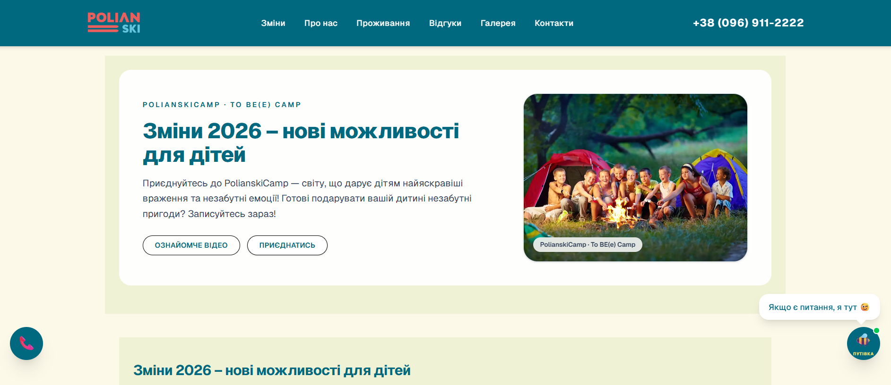

# 🏕️ PolianskiCamp / To BE(e) Camp 2026

[](https://polianski-camp.vercel.app/)
[](https://nextjs.org/)
[](https://github.com/RomanKozar/polianski-camp/releases)



## 🐝 Про проєкт

**PolianskiCamp** — це сучасний односторінковий лендинг для дитячого табору, створений для презентації літнього сезону 2026 року. Сайт фокусується на зручності користувача, швидкому доступі до розкладу змін, програми та легкому бронюванні.

**🔗 Репозиторій:** [github.com/RomanKozar/polianski-camp](https://github.com/RomanKozar/polianski-camp)

---

## 🎭 Про табір: To BE(e) Camp

**To BE(e) Camp** — це творчі театральні кемпи, які проводять актори та педагоги. Тут діти пробують себе в акторстві, імпровізації та командних проєктах.

**Що чекає на дітей?**

- 🎬 **Акторська майстерність:** зйомки кліпів, постановка танців та вистав.
- ⛰️ **Пригоди:** похід на гору Ріжок, лісові квести зі смугою перешкод від сертифікованих інструкторів.
- 🏰 **Екскурсії:** Палац графа Шенборна, замок Сент-Міклош, контактний зоопарк.
- 💦 **Розваги:** басейн, мотузковий парк, батути.
- 🎨 **Творчість:** розпис шоперів, картини акрилом, виготовлення прикрас.
- 🫂 **Підтримка:** супровід дитячого психолога та арттерапевта.

---

## 🗓 Літні зміни 2026 (Групи до 20 дітей)

|  Заїзд  | Дати          | Стандартна ціна | Раннє бронювання (до 15.05) |
| :-----: | :------------ | :-------------- | :-------------------------- |
| **1-й** | 21.06 – 29.06 | 💲 23 500 грн   | 22 000 грн                  |
| **2-й** | 07.07 – 15.07 | 💲 23 500 грн   | 22 000 грн                  |
| **3-й** | 18.07 – 26.07 | 💲 23 500 грн   | 22 000 грн                  |
| **4-й** | 29.07 – 06.08 | 💲 23 500 грн   | 22 000 грн                  |
| **5-й** | 09.08 – 17.08 | 💲 23 500 грн   | 22 000 грн                  |

---

## 🏠 Проживання та харчування

Кемпери проживають у комфортному хостелі **Готелю «Катерина»** (3-й поверх повністю під табір).

- **Кімнати:** 5 затишних кімнат (від 2 до 6 місць) із чистою постільною білизною.
- **Інфраструктура:** 4 сучасні санвузли, 3 душові, велика зона для майстер-класів та обладнана кухня. Бювет із мінеральною водою «Поляна».
- **Безпека:** наставники 24/7, цілодобовий відеонагляд на території.
- **Харчування (5 разів на день):** 3 основних прийоми (гарячі сніданки, обіди, вечері) + 2 додаткові перекуси (фрукти, печиво, чай).

---

## 🛠 Технологічний стек проєкту

Проєкт розроблено з акцентом на швидкість завантаження та SEO-оптимізацію:

- **Framework:** [Next.js 15](https://nextjs.org/) (App Router)
- **Language:** TypeScript
- **Styling:** Tailwind CSS (з кастомними дизайн-токенами у `globals.css`)
- **Optimization:** Вбудований компонент `next/image` для WebP та lazy loading.

---

## 🚀 Локальний запуск

Щоб запустити проєкт розробки на своєму комп'ютері:

1. **Клонуйте репозиторій та встановіть залежності:**
   ```bash
   git clone [https://github.com/RomanKozar/polianski-camp.git](https://github.com/RomanKozar/polianski-camp.git)
   cd polianski-camp
   npm install
   ```
